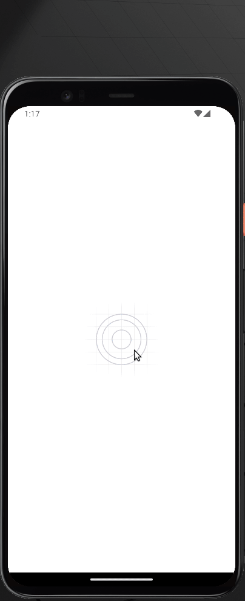

# Expenses Manager Demo App

Este é um app demonstração para *gerenciar de despesas*, para estudo / prática de conceitos relacionados a gerenciamento de estados globais, hooks, entrada de dados, navegação (com React Navigation), incluindo menus aninhados, questões avançadas de layout (tema, grids, orientação), utilizando React Native.
O projeto está estruturado em `/src` com prettier e eslint, baseado em um boilerplate que criei.

<!-- ### Mobile Perspectiva:
 -->

## Bibliotecas utilizadas

- expo - Framework React Native
- React Navigator - Navegação / Menus
- Constate - Gerenciador de contexto React

# Instalando e rodando o projeto
Antes de instalar/rodar o projeto, você precisa dos seguintes itens:
- Node para rodar o `npm`. Você pode instala-lo [aqui](https://nodejs.org/en/). Este projeto foi construído no node versão `18.x`;
- Um celular Android ou iOS com o aplicativo Expo instalado, ou então algum emulador Android ou iOS no computador;

- Agora, na pasta raíz do projeto, execute:
```
 npm i
```

```
 npm start
```

- Execute o app no emulador ou no celular à sua escolha.
## Construído com

- [ReactJS](https://pt-br.reactjs.org/) - Biblioteca Front-end.
- [TypeScript](https://www.typescriptlang.org/) - Superset JavaScript.
- [React Native](https://reactnative.dev/) - Framework Front-end.

## Autor

- **Osvaldo Costa** - [rimancete](https://github.com/rimancete)

## Melhorias propostas

Como o projeto é acadêmico, o foco realmente foi esse. Tendo isso em mente, seguem sugestões:

- Técnica
  - Melhorar importações

- Layout
  - Implementação de fonte personalizada
  - Ajustes finos em orientação paisagem